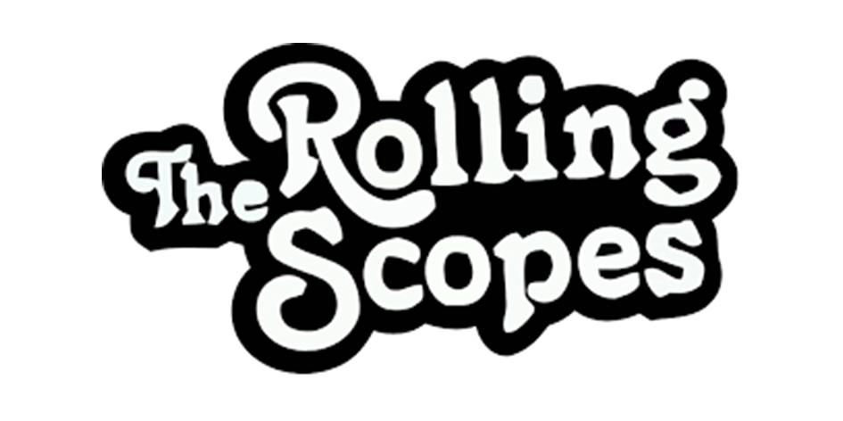

<a id="anchor"></a>
#Glib Shemenkov
___
## My Contact Info:
* phone: +48 536-781-489
* E-mail: shemenkovglib@gmail.com
* GitHub: [Kravius](https://github.com/Kravius)
* Telegram: [Glib Shemenkov](https://t.me/Glib_Shemenkov)
___
## About Me
_I am a beginner programmer. I have learned some material from UDEMY. I am also going through the materials on the website Code mu._

_At the same time, I solve programming problems on CodeWars  and replicate the projects of experienced programmers using VSC. My next step is learning React._

* My strengths:
    * Commitment
    * honesty
    * responsibility
    * fast learning,
    * teamwork
___
## Code Examples
```
Напишите функцию, которая принимает на вход строку и возвращает ее в перевернутом виде.
let  string = '123456';
let notString = 123456;

const reverse = (str) =>
    typeof str === 'string'
    ? str.split('').reverse().join('')
    : `${str} this isn't string`;

console.log(reverse(myString)) // u will see 654321
console.log(reverse(notString)) // 123456 this isn't string
```
## Education
* __College of Education and the Administration. Mieszko I.__
    * internal audit 2017 - 2019
* __Mykhailo Ostrohradskyi Kremenchuk National University__
    * Electronics Engineer, master's degree 2008-2013
___
## Courses:
* __JS__ (in process..)
    1. [Udemy](https://www.udemy.com/course/javascript-ru/)
    2. [Code_mu](https://code.mu/ru/javascript/book/prime/)
* __HTML&CSS__ (in process..)
    1. [Code_mu](https://code.mu/ru/markup/book/prime/)
*   __Git__ (in process..)
    1. [Youtube](https://www.youtube.com/watch?v=O00FTZDxD0o)
* __Visual Studio Code__


___
## Languages
*   __Ukrainian__ - _native_
*   __Russian__ - _native_
* __Polish__ - _B1_
* __English__ - _A2_
___
###### click =>[](https://rs.school)
[Up](#anchor)